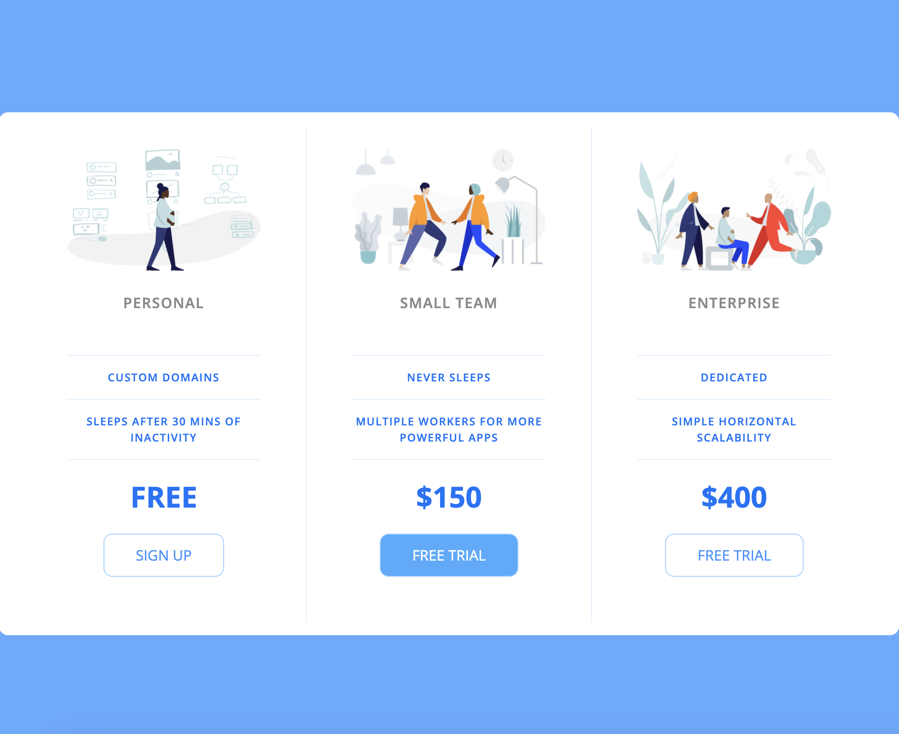

# Pricing-Panel-Project

This project is a simple, responsive pricing table built with HTML and CSS. It displays three different pricing plans: Personal, Small Team, and Enterprise, each with its own set of features and pricing details.

##  Key CSS Techniques
1. CSS Reset:
Resets margin, padding, and other properties to ensure consistency across browsers.

2. Flexbox:
Used for layout purposes (display: flex), ensuring responsive design.
flex-direction: column for mobile layout.
flex-direction: row within media queries for larger screens.

3. Responsive Design:
Media queries (@media (min-width: 900px)) to adjust the layout for different screen sizes.

4. Styling and Theming:
Use of colors, font weights, letter spacing, and borders to create a visually appealing design.
Hover and focus effects for interactive elements.

